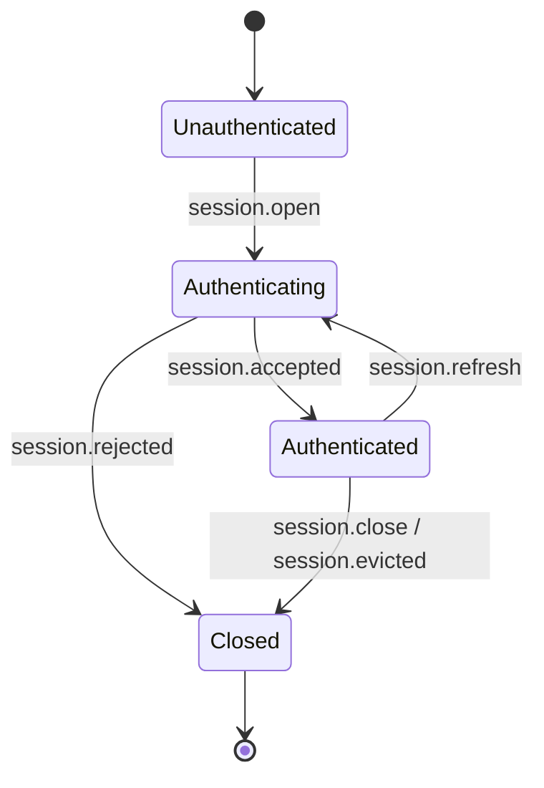
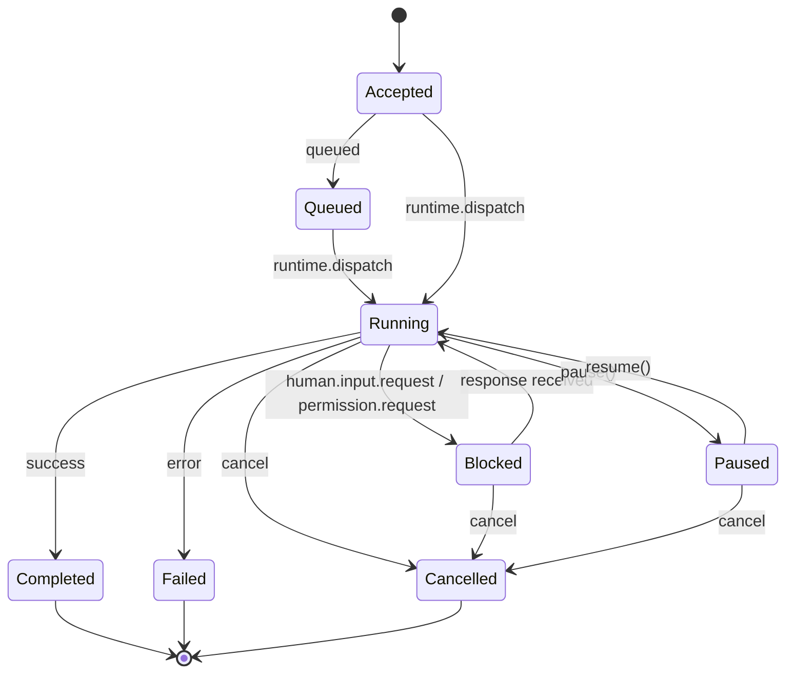
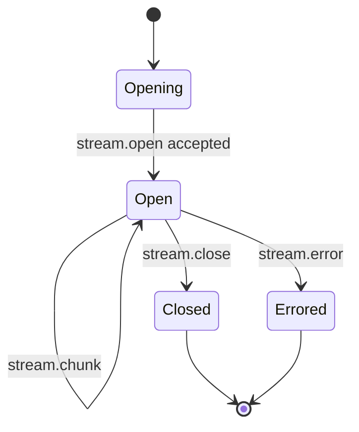
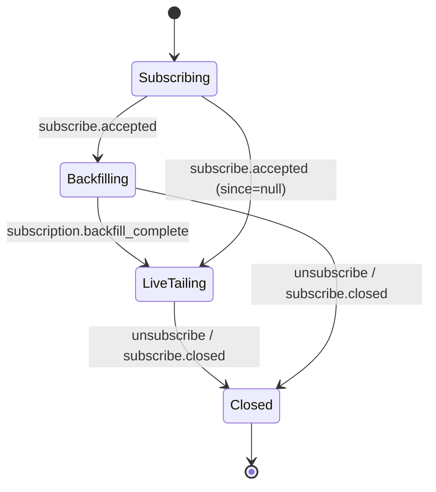
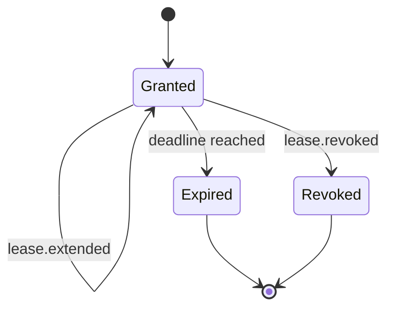

# ARCP Kotlin SDK — Implementation Plan

This is the v0.1 plan for the `kotlin-sdk` reference implementation of the Agent
Runtime Control Protocol (ARCP) v1.0 as specified in `RFC-0001-v2.md` (vendored
in this directory). It is the Phase 0 deliverable required before any code is
written.

The plan is organized as:

1. RFC section walk-through with implementation impact.
2. Message-type to package/data-class mapping.
3. State machines (sessions, jobs, streams, subscriptions, leases) with mermaid
   diagrams and the sealed class shape that backs each one.
4. Open questions / RFC ambiguities and the chosen interpretation for v0.1.
5. Test plan: integration tests, scenarios, RFC-section coverage, and which
   tests use Kotest property-based generation.
6. Kotlin-specific design choices: sealed interfaces, value classes, structured
   concurrency, Flow, CompletableDeferred, CoroutineContext propagation.
7. Dependency justifications.

The build runs in seven hard-gated phases (Phase 0 is this plan). Each phase
ends with `./gradlew ktlintCheck && ./gradlew detekt && ./gradlew build &&
./gradlew koverHtmlReport && ./gradlew dokkaHtml` exiting clean.

---

## 1. RFC Walk-Through

### §1–§5 — Goals, non-goals, terminology, design principles, architecture

These sections motivate the protocol and define common vocabulary. They have no
direct implementation surface but they pin three commitments we honor end-to-end:

- **Transport agnostic** (§4.1). The runtime, client, message types, and tests
  all sit above a single `Transport` interface; every integration test in the
  Phase 6 suite is parameterized over both transports we ship (WebSocket,
  stdio) and the in-process `MemoryTransport` used by Phases 2–5.
- **Streaming native** (§4.2) and **event driven** (§4.5). Public read APIs
  expose `Flow<T>`. Backpressure is a first-class signal type, not an ad-hoc
  knob.
- **Authenticated by default** (§4.6). Sessions are modeled as a sealed state
  machine where the only state that accepts non-handshake messages is
  `Authenticated`. The compiler enforces this at the dispatch site.

### §6 — Core protocol concepts

§6.1 — **Envelope**. The envelope is a `data class Envelope` containing the
flat fields plus a polymorphic `payload: MessageType`. kotlinx.serialization
encodes the discriminator as the top-level `type` field. We support every field
listed in §6.1.1, including `idempotency_key`, `priority`, `extensions`,
`correlation_id`, `causation_id`. The wire format puts the polymorphic payload
**outside** an embedded object: when serializing, `type` is hoisted to the
envelope level alongside `id`, `timestamp`, etc., and `payload` is the object
literal containing everything else. We accomplish this by serializing the
envelope as one combined object (custom serializer for `Envelope`) so the wire
shape matches the RFC examples exactly.

§6.2 — **Message types**. The full §6.2 list is mapped to data classes in §2
below.

§6.3 — **Command/result/event flow**. Implemented in `runtime.JobManager` with
the per-command flow: `ack` or `job.accepted` → `job.started` → progress/log/
metric/heartbeat → exactly one terminal event.

§6.4 — **Delivery semantics**. The event log enforces id-level idempotency
(`UNIQUE` constraint on `(session_id, message_id)`); `idempotency_key` is
maintained as a separate `(session_principal, idempotency_key)` index that
returns the prior outcome if present. Ordering is guaranteed within
`stream_id` and `job_id` by the per-key `MutableSharedFlow` boundaries.

§6.5 — **Priority and QoS**. `priority` is an `enum class Priority { LOW,
NORMAL, HIGH, CRITICAL }`. The `JobManager` consumes from a priority queue
(`java.util.PriorityQueue` wrapped behind a `Channel`-shaped suspending API)
that biases higher priorities while reserving a fairness floor for lower ones.
Within a `stream_id`/`job_id`, ordering wins over priority — we do not reorder.

### §7 — Capability negotiation

A `data class Capabilities` wraps the negotiated booleans plus the extension
list. Both sides exchange offered capabilities; the runtime computes the
intersection and refuses required-but-unsupported features with
`session.rejected` carrying `code: UNIMPLEMENTED`. Absent boolean ⇒ `false`
(`@Serializable` defaults are explicit, no `null`).

### §8 — Authentication & identity

Four-message handshake driven by `runtime.Session`. Auth schemes for v0.1:

- `bearer` — token string compared against an injected `BearerAuth` implementation.
- `signed_jwt` — validated via `nimbus-jose-jwt`, with `aud` matched to the
  runtime identity.
- `none` — only accepted when `capabilities.anonymous: true` was negotiated.

`mtls` and `oauth2` are explicitly out of scope for v0.1; both throw
`ARCPException.Unimplemented(section = "§8.2", detail = "...")` if requested.

§8.4 (re-authentication) — implemented as a `session.refresh` event raised by
the runtime; client must respond with a fresh `session.authenticate` within the
deadline or the session is evicted.

§8.5 (eviction) — `session.evicted` carries a canonical `reason` from §18.2.

### §9 — Sessions

Stateless and stateful sessions are both supported. **Durable sessions are
deferred to v0.2** — Phase 5's `resume` only restores state that lives in the
event log, not in the runtime's in-memory caches. Closing a session via
`session.close` cancels every running job in the session's `supervisorScope`,
and the runtime's policy decides whether to wait for clean checkpoints.

### §10 — Jobs

Implemented in full per the spec:

- §10.2 — eight-state machine, modeled as a `sealed class JobState`. Every job
  emits exactly one terminal state.
- §10.3 — heartbeats. A per-job watchdog coroutine uses `select { }` on a
  `Channel<JobHeartbeat>` and `onTimeout(deadline)`. After two missed deadlines
  (default `N=2`), the job transitions to `failed` with `HEARTBEAT_LOST` (or
  `blocked` if `capabilities.heartbeat_recovery == "block"`).
- §10.4 — cancellation. Cooperative via the coroutine job hierarchy. Hard
  deadline escalation emits `code: ABORTED` if the cooperative path doesn't
  complete in `deadline_ms`.
- §10.5 — interrupts transition to `blocked` and emit `human.input.request`.
- §10.6 — scheduled jobs **deferred to v0.2**. Schedule requests `nack` with
  `UNIMPLEMENTED`.

### §11 — Streaming

§11.1 stream kinds: `text`, `binary`, `event`, `log`, `metric`, `thought` —
modeled as `enum class StreamKind` (unknown kind decoded as `event` per §11.1).

§11.2 backpressure: a `backpressure` envelope updates the producer's per-stream
rate via a shared atomic; the producer's `Flow`-based emit path checks rate
before each chunk and `delay`s as needed.

§11.3 binary encoding: **base64 in-envelope only** for v0.1. Sidecar binary
frames are out of scope. `capabilities.binary_encoding` advertises `["base64"]`
exactly.

§11.4 reasoning streams: `kind: thought` chunks carry a `role`, `content`, and
`redacted` flag. Subscribers can filter by kind.

### §12 — Human-in-the-loop

Implemented in full for v0.1, except quorum-policy multi-channel resolution
(`capabilities.human_input_quorum: false`). First-response-wins is the v0.1
default. `responseSchema` is validated using `com.networknt:json-schema-validator`
when present.

### §13 — Subscriptions

Implemented in full. Filters AND across fields, OR within arrays. The
`SubscriptionManager` compiles each filter to a typed `(Envelope) -> Boolean`
predicate at subscribe time and rejects unauthorized filters with
`PERMISSION_DENIED`. Backfill streams from the event log followed by a
synthetic `subscription.backfill_complete` `event.emit`, then live-tails from
a `MutableSharedFlow<Envelope>` fed by every produced envelope.

### §14 — Multi-agent coordination

**Out of scope for v0.1.** `agent.delegate` and `agent.handoff` envelopes are
defined as data classes (so they round-trip cleanly), but the runtime returns
`UNIMPLEMENTED` if a client sends them.

### §15 — Permissions & leases

§15.1–§15.5 — fully implemented for v0.1. Sessions hold a per-session
`LeaseSet`. Operations attempt the resource lookup `(permission, resource)` →
lease; missing/expired/revoked leases throw `ARCPException.PermissionDenied`,
`LeaseExpired`, or `LeaseRevoked` from the boundary, which the runtime turns
into a structured envelope.

§15.6 trust elevation — **out of scope for v0.1**.

### §16 — Artifacts

Inline base64 only for v0.1. `artifact.put`/`fetch`/`ref`/`release` plus a
periodic in-process retention sweep (`while (isActive) { delay(...); evict() }`)
on a long-lived runtime scope. SQLite-backed blob store (BLOB column) so
artifacts survive process restart. Out-of-band fetch via redirect URI is
deferred to v0.2.

### §17 — Observability

`log` and `metric` envelope types defined. Reserved metric names (§17.3.1)
exposed as `const val` strings on a `StandardMetrics` object. SLF4J integration
via `io.github.oshai:kotlin-logging`. Trace context (`trace_id`, `span_id`,
`parent_span_id`) modeled as a `CoroutineContext.Element` that flows across
suspend calls automatically — `currentTrace()` retrieves it; `withContext(trace
+ span) { ... }` enters a child span.

`trace.span` envelope is emitted at span boundaries.

### §18 — Error model

§18.1 error envelope shape replicated in `ToolError` data class and the
`ARCPException` hierarchy. §18.2 canonical taxonomy mapped one-to-one to
`enum class ErrorCode`; each code has a corresponding `ARCPException` subclass
that carries typed context fields. §18.3 retryability defaults are encoded
as a `val retryableByDefault: Boolean` on each `ErrorCode` enum constant.

### §19 — Resumability

v0.1 supports `resume` with `after_message_id` only. Checkpoint-based resume
is deferred. The event log replays envelopes after the given id, then live
tails. If the message id is older than the retention window, the runtime
emits `code: DATA_LOSS` and lets the client decide.

### §20 — MCP compatibility

No first-class MCP support; ARCP envelopes are sufficient. Documented as a
non-goal in `CONFORMANCE.md`.

### §21 — Extensions

§21.1 naming rules enforced by `ExtensionRegistry.validateName` (regex
`^arcpx\.[a-z0-9-]+\.[a-z0-9-]+\.v\d+$` or reverse-DNS form). §21.2 negotiation:
unadvertised extension types ⇒ `nack` `UNIMPLEMENTED`. §21.3 unknown messages:
silently dropped only when `extensions.optional: true` and not advertised;
otherwise `nack`.

### §22 — Reference transports

WebSocket (Ktor) and stdio (newline-delimited JSON) — both mandatory for v0.1.
HTTP/2 and QUIC are out of scope.

---

## 2. Message Type Mapping

Every message type from §6.2 maps to a `@Serializable @SerialName(...)
data class` implementing the sealed `MessageType` interface. Group → file:

| Group               | File                              | Types                                                                                                                                                                |
|---------------------|-----------------------------------|----------------------------------------------------------------------------------------------------------------------------------------------------------------------|
| Session             | `messages/Session.kt`             | `SessionOpen`, `SessionChallenge`, `SessionAuthenticate`, `SessionAccepted`, `SessionUnauthenticated`, `SessionRejected`, `SessionRefresh`, `SessionEvicted`, `SessionClose` |
| Control             | `messages/Control.kt`             | `Ping`, `Pong`, `Ack`, `Nack`, `Cancel`, `CancelAccepted`, `CancelRefused`, `Interrupt`, `Resume`, `Backpressure`, `CheckpointCreate`, `CheckpointRestore`           |
| Execution           | `messages/Execution.kt`           | `ToolInvoke`, `ToolResult`, `ToolError`, `JobAccepted`, `JobStarted`, `JobProgress`, `JobHeartbeat`, `JobCheckpoint`, `JobCompleted`, `JobFailed`, `JobCancelled`, `JobSchedule`, `WorkflowStart`, `WorkflowComplete`, `AgentDelegate`, `AgentHandoff` |
| Streaming           | `messages/Streaming.kt`           | `StreamOpen`, `StreamChunk`, `StreamClose`, `StreamError`                                                                                                            |
| Human-in-the-loop   | `messages/Human.kt`               | `HumanInputRequest`, `HumanInputResponse`, `HumanChoiceRequest`, `HumanChoiceResponse`, `HumanInputCancelled`                                                        |
| Permissions         | `messages/Permissions.kt`         | `PermissionRequest`, `PermissionGrant`, `PermissionDeny`, `LeaseGranted`, `LeaseExtended`, `LeaseRevoked`, `LeaseRefresh`                                            |
| Subscriptions       | `messages/Subscriptions.kt`       | `Subscribe`, `SubscribeAccepted`, `SubscribeEvent`, `Unsubscribe`, `SubscribeClosed`                                                                                 |
| Artifacts           | `messages/Artifacts.kt`           | `ArtifactPut`, `ArtifactFetch`, `ArtifactRef`, `ArtifactRelease`                                                                                                     |
| Telemetry           | `messages/Telemetry.kt`           | `EventEmit`, `Log`, `Metric`, `TraceSpan`                                                                                                                            |

Helper types (`Auth`, `ClientInfo`, `RuntimeIdentity`, `Capabilities`,
`StreamKind`, `LeaseSpec`, `ArtifactRefSpec`) live alongside the message
types in the same files. Newtype IDs (`SessionId`, `MessageId`, `JobId`,
`StreamId`, `SubscriptionId`, `LeaseId`, `ArtifactId`, `TraceId`, `SpanId`,
`PermissionName`, `ToolName`) live in `ids/Ids.kt` as `@JvmInline value class`.

---

## 3. State Machines

### 3.1 Session

Modeled as `sealed class SessionState { Unauthenticated; Authenticating;
Authenticated(...); Closed(reason) }`. Only `Authenticated` accepts
non-handshake messages — that's enforced via `when` exhaustiveness on the
state at dispatch.

### 3.2 Job

Modeled as `sealed class JobState`; each state holds the data relevant to it.
Terminal states (`Completed`, `Failed`, `Cancelled`) emit exactly one
terminal envelope.

### 3.3 Stream

Modeled as `sealed class StreamState`. Backpressure does not move the state;
it modulates the producer's emit rate.

### 3.4 Subscription

Modeled as `sealed class SubscriptionState`. `Backfilling` and `LiveTailing`
share the same predicate; only the source `Flow<Envelope>` differs.

### 3.5 Lease

Modeled as `sealed class LeaseState`. Operations attempted with `Expired` or
`Revoked` throw the typed `ARCPException`.

---

## 4. Open Questions / Ambiguities

| RFC § | Question | v0.1 decision |
|-------|----------|---------------|
| §6.1 | The example envelope nests payload as an object, but `type` is at the envelope level. kotlinx.serialization's polymorphism puts the discriminator inside the payload object. | Custom `EnvelopeSerializer` flattens: `type` and the payload object's body merge at the top level when serializing. |
| §6.4 | Retention horizon for `idempotency_key` is "at least the lease horizon of the operation" — vague. | Default 24h; configurable on the `EventLog`. |
| §6.5 | "Fairness floors that prevent starvation" — no specific algorithm given. | We implement weighted round-robin: `CRITICAL ≫ HIGH ≫ NORMAL ≫ LOW` with a 1-in-16 floor for the lowest non-empty lane. |
| §10.3 | `capabilities.heartbeat_recovery` values are `"fail"` and `"block"` — no enum given. | Modeled as `enum class HeartbeatRecovery { FAIL, BLOCK }` with `@SerialName("fail")` / `@SerialName("block")`. |
| §10.4 | "Hard kill" — what does this mean inside a coroutine? | We `cancel()` the parent `Job` with a `CancellationException("ABORTED")` and emit the terminal event from the supervisor. We do not `Thread.interrupt()` underlying threads. |
| §11.1 | `kind: binary` is defined but binary sidecar frames are explicitly v0.2. | `binary` accepted only with base64 encoding; `capabilities.binary_encoding == ["base64"]`. Sidecar frames result in `UNIMPLEMENTED`. |
| §11.2 | Backpressure `desired_rate_per_second` — unit? | Chunks per second. Documented in KDoc on the `Backpressure` data class. |
| §12.4 | "Emit a terminal event when the deadline passes" — what envelope type? | `human.input.cancelled` with `code: DEADLINE_EXCEEDED` for both `human.input.request` and `human.choice.request` timeouts. |
| §13.3 | "Synthetic event.emit of type `subscription.backfill_complete`" — what does that mean inside an `event.emit` envelope? | The `event.emit` payload carries `payload.event_type = "subscription.backfill_complete"` and `payload.data = {}`. |
| §15.5 | Lease `refresh` vs `extended` — symmetric or asymmetric? | Holder sends `lease.refresh`; grantor responds with `lease.extended` (success) or `lease.revoked` (refusal). |
| §17.3.1 | `dims.kind ∈ input, output, cache_read, cache_write` — case-sensitive? | Lower-snake-case enforced via `enum class TokenKind`. |
| §18.2 | `RATE_LIMITED` is "an alias" of `RESOURCE_EXHAUSTED`. | We expose `ErrorCode.RESOURCE_EXHAUSTED` as canonical and accept `RATE_LIMITED` on decode (translated). Encoding always emits `RESOURCE_EXHAUSTED`. |
| §19 | `include_open_streams: true` — does the runtime resume open streams or just replay their close events? | v0.1 replays only what's in the event log. Open streams are not auto-resumed; the client receives the `stream.close` if one was emitted, otherwise the stream simply ends. Documented in `CONFORMANCE.md`. |
| §21.3 | `extensions.optional: true` lives in `extensions` on the envelope. | We model `extensions` as `Map<String, JsonElement>` and treat the literal key `optional` (no namespace) as a special boolean. This matches how the RFC's example reads. |

---

## 5. Test Plan

The full suite runs against `MemoryTransport` (Phases 2–5), then re-runs
parameterized over WebSocket and stdio in Phase 6. Property-based tests
(Kotest `forAll`) are marked **(prop)** below.

### Unit tests in `:lib`

| File | Coverage |
|------|----------|
| `envelope/EnvelopeRoundTripTest.kt` | Round-trip every message type; arbitrary payloads (prop). |
| `envelope/EnvelopeFieldsTest.kt` | Conditional field validation (`session_id` required when present, etc). |
| `error/ARCPExceptionTest.kt` | Each error code has a constructor, `code` matches enum, cause-chains preserved. |
| `error/ErrorCodeTest.kt` | `retryableByDefault` matches §18.3 table; alias decoding for `RATE_LIMITED`. |
| `extensions/ExtensionRegistryTest.kt` | Naming regex (prop): valid arcpx names accepted, invalid rejected; reverse-DNS accepted. |
| `extensions/UnknownMessageTest.kt` | Optional unknown silently dropped; non-optional → `nack UNIMPLEMENTED`. |
| `ids/IdsTest.kt` | Value class round-trip; blank-id rejection (prop); ULID generation uniqueness (prop). |
| `store/EventLogTest.kt` | Append, dedup by `id`, replay ordering; `idempotency_key` returns prior outcome. |

### Integration tests in `:tests`

| File | Scenario | Sections |
|------|----------|----------|
| `HandshakeTest.kt` | Happy path; bad token → `UNAUTHENTICATED`; unsupported required cap → `UNIMPLEMENTED`; anonymous-without-cap → `UNAUTHENTICATED`; mid-handshake disconnect → cleanly closed; replayed `id` rejected. | §8.1, §7 |
| `JobLifecycleTest.kt` | All eight states reachable; exactly one terminal event; replay matches original message stream after resume. | §10.2 |
| `HeartbeatTest.kt` | (Uses `runTest` virtual time.) Two missed deadlines → `HEARTBEAT_LOST` when `recovery=fail`; → `blocked` when `recovery=block`. | §10.3 |
| `CancellationTest.kt` | `cancel.accepted` then `job.cancelled` within deadline; deadline expiry escalates to `ABORTED`; `cancel.refused` for already-terminal jobs. | §10.4 |
| `InterruptTest.kt` | Interrupt → blocked → `human.input.request` round-trips → resumed. | §10.5 |
| `HumanInputTest.kt` | Input request validates `response_schema` (prop: arbitrary valid + invalid responses); choice request resolves; expiration synthesizes default; expiration without default → `human.input.cancelled DEADLINE_EXCEEDED`. | §12 |
| `PermissionLeaseTest.kt` | Permission challenge → grant → lease used → expired → `LEASE_EXPIRED`; revocation mid-flight → `LEASE_REVOKED`. | §15.4–§15.5 |
| `SubscriptionTest.kt` | Filter dimensions (prop: arbitrary filter combinations match the right events); backfill emits `subscription.backfill_complete`; live tail picks up post-boundary; unauthorized filter → `PERMISSION_DENIED`. | §13 |
| `ArtifactTest.kt` | Put-fetch-release; retention sweep evicts past-deadline artifacts; fetch after release → `NOT_FOUND`. | §16 |
| `ResumeTest.kt` | Resume after forced disconnect with no message gap; resume past retention → `DATA_LOSS`. End-to-end variant uses `ProcessBuilder` to kill and restart the runtime JVM. | §19 |
| `ExtensionUnknownTest.kt` | Optional unknown silently dropped at the envelope layer; non-optional `nack`'d. | §21.3 |
| `e2e/RelayScenarioTest.kt` | Multi-channel `human.input.request`; first response wins; other channels notified via `human.input.cancelled`. | §12.3 |

---

## 6. Kotlin Design Choices

- **Sealed interface for envelope dispatch.** `MessageType` is a sealed
  interface; every concrete message is `@SerialName(...) data class ... :
  MessageType`. `when` over the value is exhaustive and the compiler errors on
  any unhandled case. kotlinx.serialization's `classDiscriminator = "type"`
  handles polymorphic encode/decode without per-class code.
- **Newtype IDs as `@JvmInline value class`.** Zero allocation overhead at
  runtime; type-safe — mixing `JobId` and `SessionId` is a compile error;
  serialized as bare strings via kotlinx.serialization's value-class support.
- **Coroutines + structured concurrency.** Every async method is `suspend`. The
  runtime owns a top-level `SupervisorJob`; sessions are children; jobs are
  children of sessions; heartbeat watchdogs and stream pumps are children of
  jobs. Cancellation is cooperative and propagates without manual plumbing.
- **`coroutineScope { }` and `supervisorScope { }`**. Used throughout. Job
  failures take down their job; session failures take down their jobs;
  runtime failures take down the runtime — all by structured-concurrency
  defaults.
- **`Flow<T>` / `Channel<T>` for streams.** Public read APIs return
  `Flow<StreamChunk>` / `Flow<Envelope>`. Hot fan-out uses
  `MutableSharedFlow<Envelope>`; bounded backpressure uses
  `Channel(BUFFER, BufferOverflow.SUSPEND)`.
- **`CompletableDeferred` for pending-correlation registry.** A
  `ConcurrentHashMap<MessageId, CompletableDeferred<MessageType>>` plus
  per-entry timeout watchdogs. `await()` suspends; `complete(value)` resolves.
- **`CoroutineContext.Element` for trace propagation.** `TraceContext`
  flows across suspend calls automatically — no `AsyncLocal`/`ScopedValue` shim.
- **Sealed exception hierarchy.** `ARCPException` is sealed with one subclass
  per `ErrorCode`, each carrying typed context (`leaseId`, `permission`,
  `resource`). Public APIs throw only `ARCPException` (or
  `IllegalArgumentException` for caller bugs).
- **Data classes everywhere.** Default to `data class` for all value-shaped
  types — free `equals`, `hashCode`, `toString`, `copy()`. Reach for non-data
  classes only when identity matters (`ARCPRuntime`, `ARCPClient`).
- **No global state.** Every reachable thing belongs to an `ARCPRuntime` or
  `ARCPClient` instance. Tests instantiate multiple runtimes in parallel
  without contention.
- **Explicit nulls.** No `!!`; no `lateinit` outside DI/test fixtures. If a
  value can be absent, the type says so.

---

## 7. Dependencies and Justifications

All declared in `gradle/libs.versions.toml`.

| Dependency | Why we need it | Why not the alternative |
|------------|----------------|-------------------------|
| `kotlinx-coroutines-core` | Core async primitive. | None — this is the only credible Kotlin choice. |
| `kotlinx-serialization-json` | Polymorphic JSON via sealed interfaces and `@SerialName`. | Jackson/Moshi would force runtime reflection or hand-written adapters. |
| `kotlinx-datetime` | `Instant` interop with kotlinx.serialization. | `java.time.Instant` works, but kotlinx-datetime composes more cleanly with the `Json` config. |
| `ktor-server-core/netty/websockets` | WebSocket server transport. | Java's built-in `HttpServer` lacks WS; Spring is over-the-top. |
| `ktor-client-core/cio/websockets` | WebSocket client transport. | OkHttp would force a second async model on top of coroutines. |
| `xerial:sqlite-jdbc` | Embedded SQLite, no native deps. | H2/HSQLDB don't match SQLite's footprint or replay semantics. |
| `nimbus-jose-jwt` | JWT validation for `signed_jwt`. | Auth0 java-jwt has fewer algorithms; jjwt requires more boilerplate. |
| `io.github.oshai:kotlin-logging-jvm` | SLF4J with idiomatic Kotlin lazy lambdas. | Direct SLF4J is verbose. |
| `slf4j-api` | Required by kotlin-logging. | — |
| `com.networknt:json-schema-validator` | `human.input.request.response_schema` validation. | Justify inline schema validation in <300 lines? Not worth it. |
| `clikt` | CLI framework. | picocli is verbose; argparse4j is ugly in Kotlin. |
| `kotest-runner-junit5`, `kotest-assertions-core`, `kotest-property` | Property-based + spec-style testing. | JUnit Jupiter alone lacks a property generator. |
| `kotlinx-coroutines-test` | Virtual time, `runTest`, deterministic test dispatchers. | Real time means flaky heartbeat tests. |
| `logback-classic` | SLF4J impl for tests. | — |

We do NOT add: Spring, Guice/Dagger/Koin (no DI framework needed), Arrow,
kotlinx-html, or any reactive library beyond Flow.

ULIDs are implemented in 50 lines locally rather than pulling another dep.

---

## 8. Phase-by-Phase Execution Plan

Each phase ends with the gate command set passing. Commits are tagged
`phase N: <gate description>`.

| Phase | Scope | Gate |
|-------|-------|------|
| 0 | This plan + Gradle skeleton. | Gate command set clean (zero tests OK). |
| 1 | Envelope, IDs, errors, extensions, JSON config, event log. | All Phase 1 tests pass; coverage ≥90% on `:lib` Phase 1 packages. |
| 2 | Messages, session handshake, capability negotiation. | Handshake integration test green; all message-type round-trip tests green. |
| 3 | Jobs, streams, cancellation, interrupts, heartbeats. | Job + stream integration tests green; heartbeat tests deterministic under `TestScope`. |
| 4 | Human-in-the-loop, permissions, leases. | HITL + permission integration tests green; in-process round-trip <50ms p99. |
| 5 | Subscriptions, artifacts, resume. | Subscription/artifact/resume tests green; e2e resume across forced disconnect green. |
| 6 | WebSocket + stdio transports. | All prior integration tests parameterized over both transports, all green. |
| 7 | CLI, samples, README, conformance, publishing. | All six samples run; `publishToMavenLocal` produces a complete artifact; coverage ≥85% on `:lib`. |

---

## 9. Risks and Mitigations

- **Gradle/Maven Central reachability.** Dependency resolution requires
  network access. Mitigation: the version catalog is pinned; first build
  warms the cache, after which builds are reproducible offline.
- **Kotlin 2.0+ + Gradle compatibility.** We pin Kotlin via the version
  catalog and require Gradle ≥ 8.10.
- **JDK 21 toolchain.** We use `jvmToolchain(21)`; if the runner JDK is
  newer, Gradle's foojay resolver auto-provisions JDK 21.
- **kotlinx.serialization custom envelope serializer.** The wire shape (§6.1)
  hoists `type` to the envelope while keeping the rest under `payload`. This
  doesn't fit kotlinx.serialization's default polymorphic layout. Mitigation:
  a custom `EnvelopeSerializer` flattens at encode time and re-nests at decode
  time. Covered by `EnvelopeRoundTripTest`.
- **Detekt's `UndocumentedPublicClass` rule on `:lib`.** Every public symbol
  must have a KDoc citing the RFC section. Mitigation: enforced as part of
  the gate; KDocs grow alongside code, never in a final pass.
