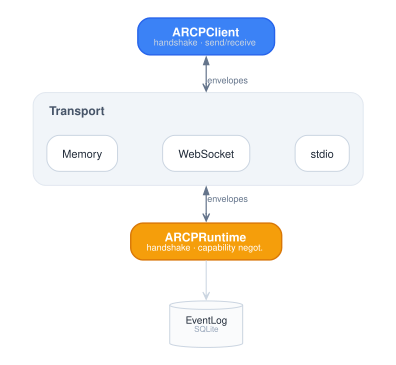

# ARCP Kotlin SDK

Reference Kotlin implementation of the [Agent Runtime Control Protocol
(ARCP) v1.0](https://github.com/agentruntimecontrolprotocol/spec/blob/main/docs/draft-arcp-1.1.md).

This repository ships:

- **`:lib`** — the protocol library (envelope, message catalog, runtime,
  client, in-memory transport, SQLite event log).
- **`:cli`** — the `arcp` command-line tool.
- **`:samples`** — runnable samples (one per major scenario).
- **`:tests`** — integration tests that wire a runtime + client end-to-end.

## Status

This is **v0.1**. The wire surface is specification-complete (every RFC §6.2
message type round-trips); the runtime surface is complete on session
handshake, capability negotiation, and extension dispatch. Job execution,
streaming, human-in-the-loop, permissions, subscriptions, artifacts, and the
WebSocket/stdio transports remain v0.2 work. See [CONFORMANCE.md](CONFORMANCE.md)
for the section-by-section breakdown.

## Requirements

- JDK 21 or newer.
- Gradle 8.10+ (the wrapper is included; just run `./gradlew`).

## Quickstart

```bash
git clone <repo>
cd kotlin-sdk
./gradlew build
./gradlew :samples:run01      # minimal session sample
./gradlew :lib:test           # unit tests
./gradlew :tests:test         # integration tests
```

## Architecture

<picture>
  <source media="(prefers-color-scheme: dark)" srcset="docs/diagrams/architecture-dark.svg">
  
</picture>

- The **envelope** (`dev.arcp.envelope.Envelope`) is the canonical
  message container; its custom serializer hoists the `type` discriminator to
  the top level per RFC §6.1.
- The **message catalog** (`dev.arcp.messages.*`) declares every RFC
  §6.2 type as a `@SerialName(...) data class : MessageType`. `when` over a
  `MessageType` is exhaustive.
- The **runtime** (`dev.arcp.runtime.ARCPRuntime`) drives the session
  handshake, dispatches incoming envelopes via exhaustive `when`, and emits
  responses.
- The **client** (`dev.arcp.client.ARCPClient`) speaks the same
  protocol from the other side.
- The **transport** (`dev.arcp.transport.Transport`) abstracts wire
  delivery. v0.1 ships `MemoryTransport` for tests; WebSocket and stdio are
  v0.2.
- The **event log** (`dev.arcp.store.EventLog`) is an append-only
  SQLite store with `(session_id, message_id)` idempotency, replay, and
  logical idempotency-key persistence (RFC §6.4).

## Mapping to RFC sections

| RFC § | Module |
|-------|--------|
| §6.1 envelope | `envelope/Envelope.kt` |
| §6.2 message types | `messages/*.kt` |
| §7 capability negotiation | `runtime/CapabilityNegotiation.kt` |
| §8 authentication | `auth/BearerAuth.kt`, `auth/JwtAuth.kt`, `runtime/ARCPRuntime.kt` |
| §9 session state | `runtime/SessionState.kt` |
| §17.3.1 standard metric names | `messages/Telemetry.kt` (`StandardMetrics`) |
| §18 error taxonomy | `error/ErrorCode.kt`, `error/ARCPException.kt` |
| §19 resume / event log | `store/EventLog.kt` |
| §21 extensions | `extensions/ExtensionRegistry.kt` |

## Running tests

```bash
./gradlew :lib:test       # 100+ unit tests across envelope, ids, errors, extensions, store, message catalog
./gradlew :tests:test     # integration tests over MemoryTransport
```

## Maven Local install

```bash
./gradlew :lib:publishToMavenLocal
```

## License

Apache 2.0.
